# Campus Lost & Found

> A campus-wide lost & found platform for Philander Smith University — report items, get matched automatically, and recover belongings through a fair claims workflow.

<p align="center">
  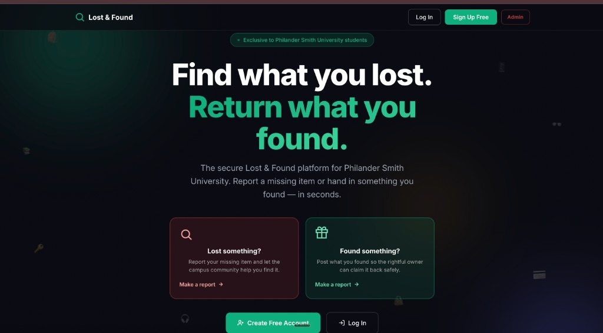
</p>

<p align="center">
  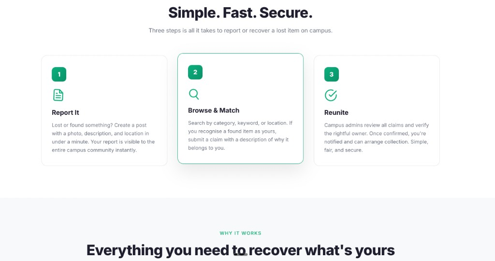
  &nbsp;
  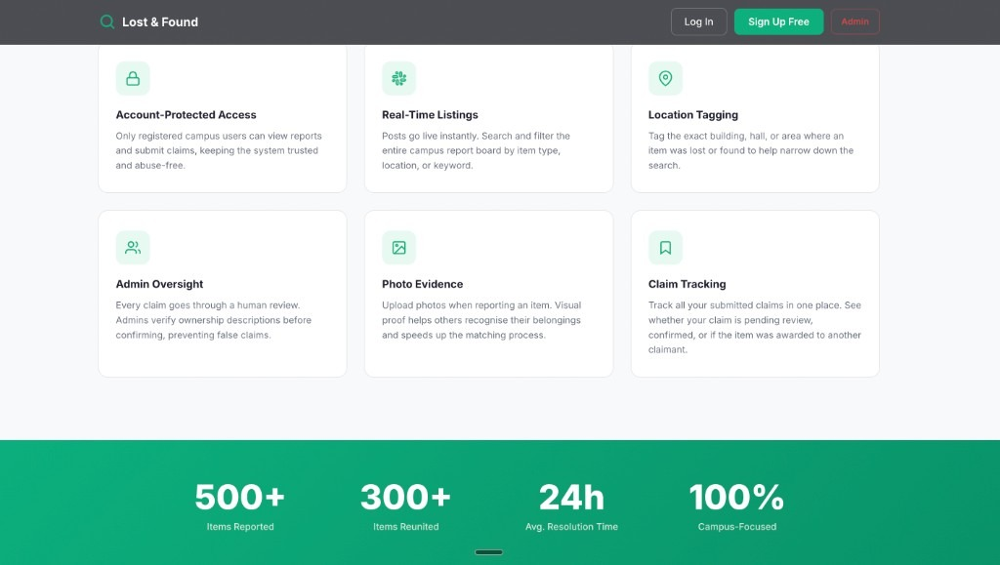
</p>

<p align="center">
  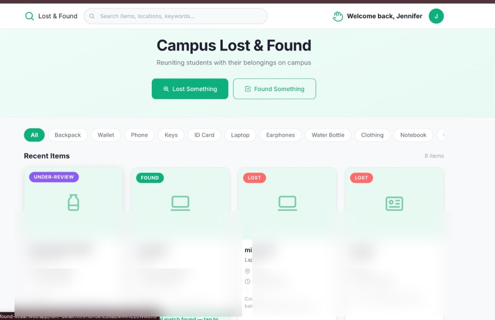
  &nbsp;
  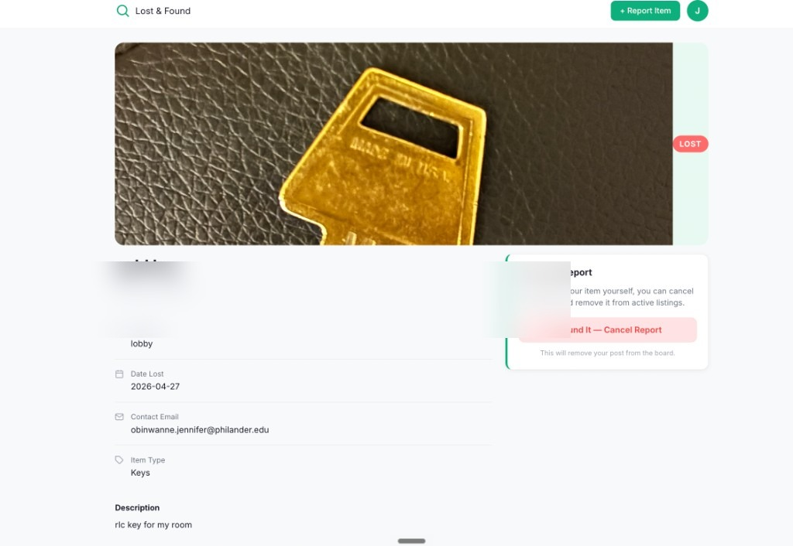
</p>

**Live demo:** [https://campus-lost-and-found-ecaaf.web.app](https://campus-lost-and-found-ecaaf.web.app) *(deploy with Firebase Hosting)*

**Repository:** [github.com/Jenn-jaee/campus-lost-and-found](https://github.com/Jenn-jaee/campus-lost-and-found)

---

## Summary

**Campus Lost & Found** is a Software Engineering capstone project built for Philander Smith University. Students and staff can report lost or found items without friction, browse active reports, and rely on automatic keyword matching to surface potential reunions. Logged-in PSU students can submit ownership claims; an admin verifies claims and resolves reports.

This README documents the full system — problem, features, architecture, setup, and deployment. Screenshots below have **contact emails blurred** for privacy.

---

## Challenge Statement

On a small campus, lost items are reported everywhere at once — group chats, bulletin boards, word of mouth — with no single source of truth. A student who loses a laptop may never see the found post in another channel. Finders have no structured way to hand items back. Security and fairness matter: anyone should be able to *report*, but only verified PSU accounts should *claim* ownership.

**The core questions we designed around:**

- How might we give campus one place to post and search lost & found items?
- How might we connect lost and found reports automatically — without manual admin matching?
- How might we let finders and owners contact each other safely, with admin oversight on ownership disputes?

---

## Project Description

Campus Lost & Found is a **responsive web application** (HTML, CSS, vanilla JavaScript) backed by **Firebase** (Auth, Firestore, Hosting). Users report items with photos (Cloudinary), location, date, and contact details. A **keyword-matching engine** links compatible lost/found pairs. The **claims workflow** lets authenticated `@philander.edu` students assert ownership; admins confirm or dismiss claims from a dedicated dashboard.

---

## How It Works

| Step | Who | What happens |
|------|-----|----------------|
| 1 | Anyone | Report a **lost** or **found** item (no account required) |
| 2 | System | Extracts keywords and scans for a **potential match** |
| 3 | Anyone | **Browse** active reports, filter by type, search by keyword |
| 4 | PSU student | **Sign up / log in** with `@philander.edu` email |
| 5 | Student | **Claim** a found item and describe why it is theirs |
| 6 | Admin | Reviews claims, **confirms owner**, marks reports **resolved** |

### Example flow

1. Student A loses a black Nike backpack in the cafeteria → submits a **Lost** report.
2. Student B finds a similar bag → submits a **Found** report.
3. The matcher links both posts → each detail page shows a **“Potential match”** banner.
4. Student A logs in, opens the found report, and **claims** the item with a distinguishing detail.
5. Admin confirms the claim → both parties use **contact info on the report** to arrange pickup.

---

## Why It Matters

- **Students** get a single, searchable board instead of scattered DMs.
- **Finders** can do the right thing without hunting for the owner.
- **Campus staff** have one admin view of all reports, claims, and resolutions.
- **Privacy-conscious design** — browse cards show **names only**; email and phone appear on the **item detail** page where contact is actually needed.

---

## Key Features

| Feature | Description |
|---------|-------------|
| **No-login reporting** | Submit lost/found reports immediately |
| **Keyword matching** | Automatic pairing of lost ↔ found reports |
| **Photo upload** | Cloudinary-backed images on reports |
| **Browse & search** | Filter by item type; client-side search |
| **PSU-only accounts** | Registration restricted to `@philander.edu` |
| **Claims workflow** | Students claim found items; admin adjudicates |
| **Admin dashboard** | View, filter, resolve, delete, manage claims |
| **Contact on detail** | Name on cards; email + optional phone on detail page |
| **Responsive UI** | Desktop and mobile layouts |

---

## Screenshots

> Contact emails are blurred in report screenshots for privacy. Browse cards show **names only** in the live app; email and phone appear on the item detail page.

### Landing page
> Hero, how-it-works steps, and feature highlights for Philander Smith University.

<p align="center">
  
</p>

<p align="center">
  
  &nbsp;
  
</p>

---

### Browse board (home)
> Active reports, filters, search, and status badges.


---

### Report Lost
> Item details, name, contact fields, and optional photo upload.

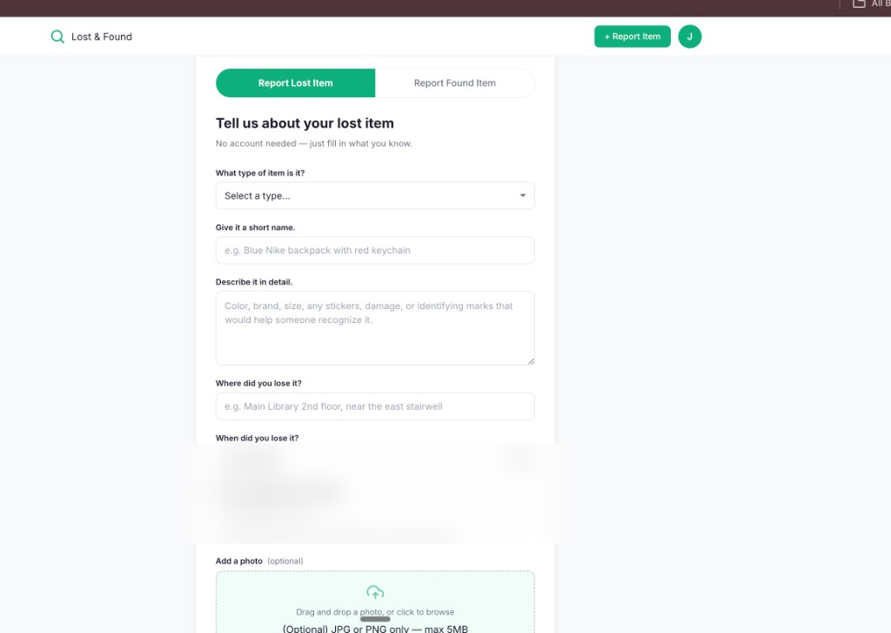

---

### Report Found
> Same form flow for found items.

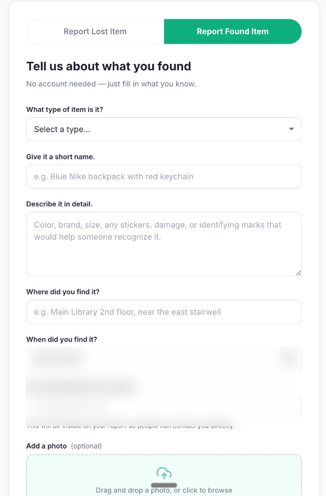

---

### Item detail — lost report
> Full metadata, contact info, and poster actions.


---

### Item detail — match & claim
> Potential match banner and claim-under-review state.

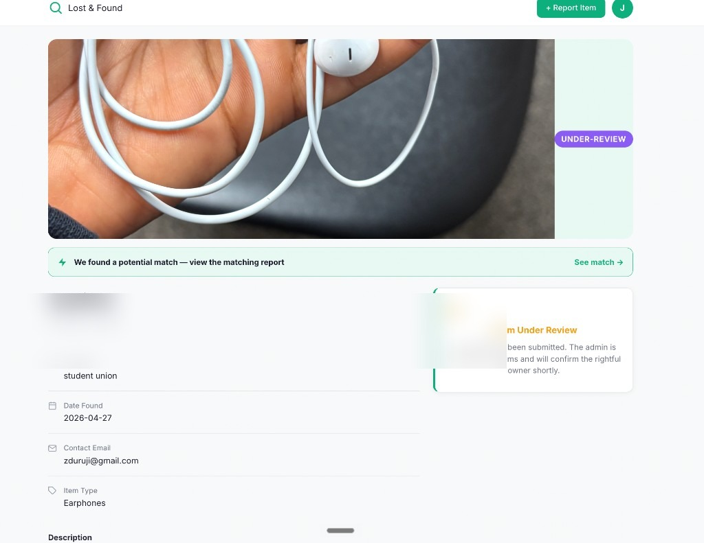

---

### Item detail — cancelled report
> Withdrawn report with match notification.

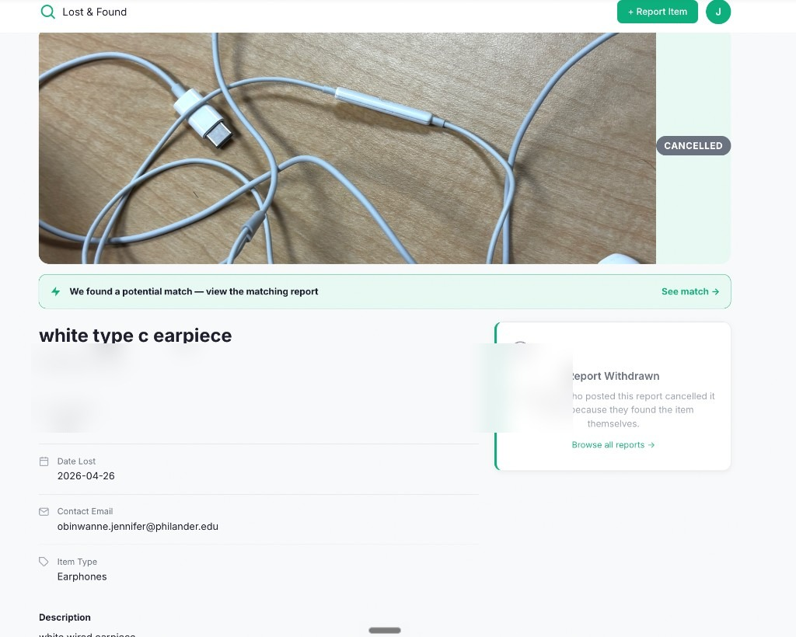

---

### Login & registration
> PSU student authentication.

<p align="center">
  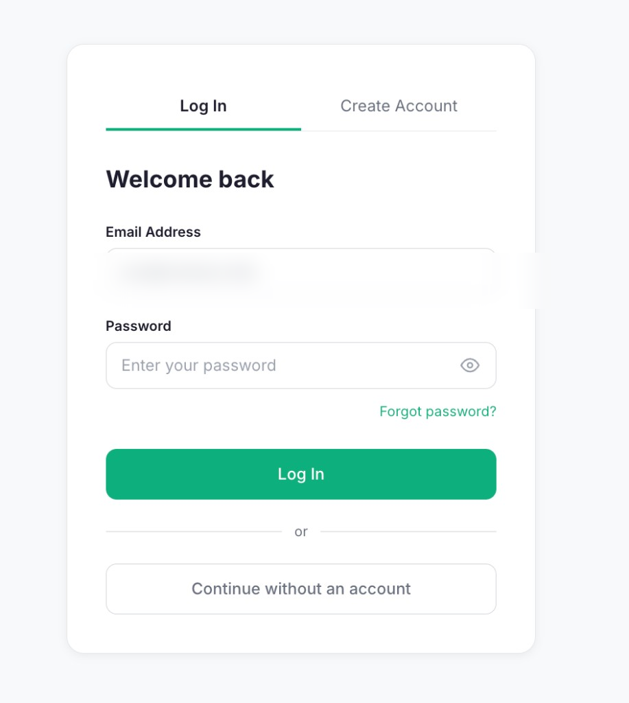
  &nbsp;
  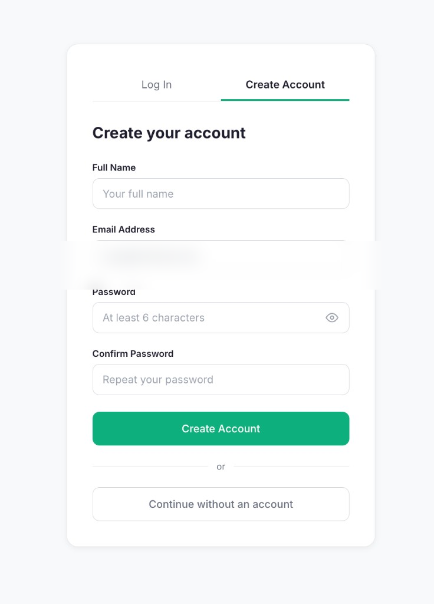
</p>

---

### Admin dashboard
> Posts table, claim review, confirm owner, resolve, and delete. Resolved reports move to the archive and auto-delete after 30 days.

<p align="center">
  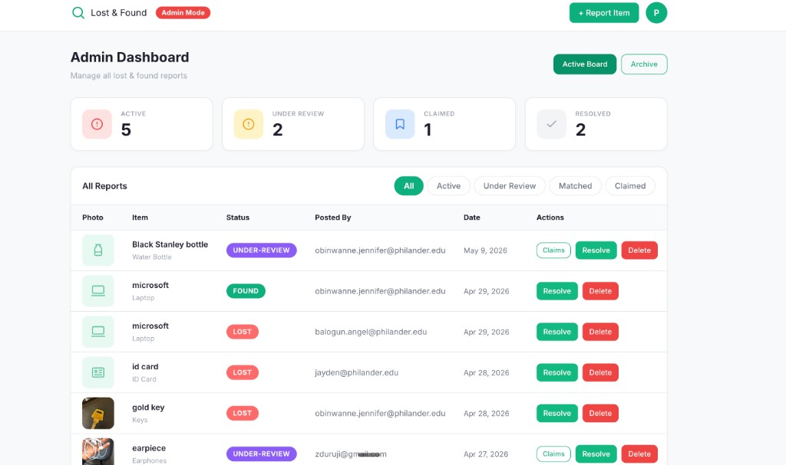
</p>

<p align="center">
  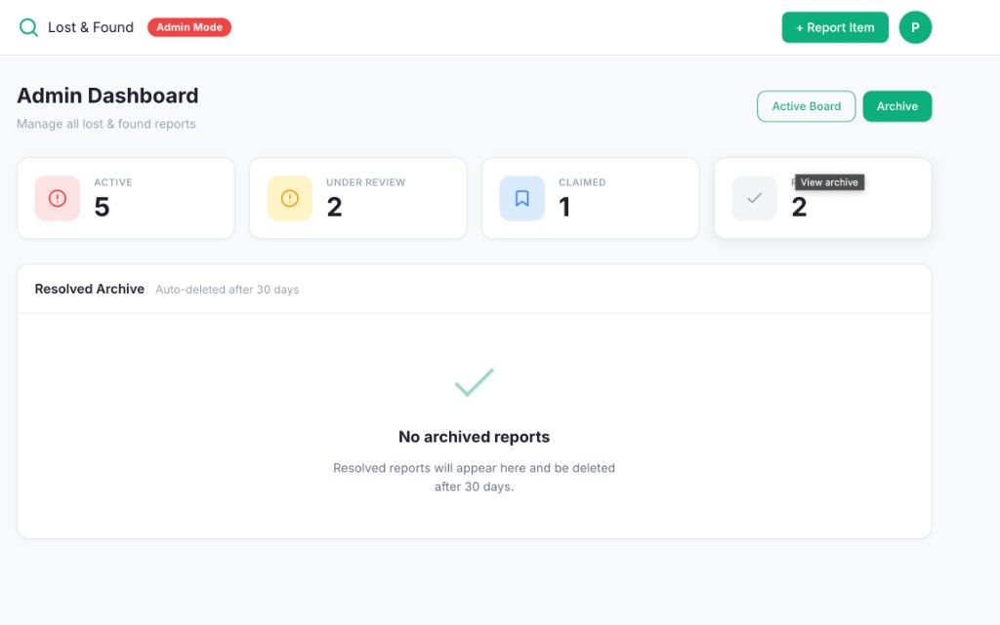
</p>

---

## Tech Stack

| Layer | Technology |
|-------|------------|
| **Frontend** | HTML5, CSS3, JavaScript (ES modules) |
| **Auth** | Firebase Authentication (email/password) |
| **Database** | Cloud Firestore |
| **Photo storage** | Cloudinary (unsigned upload preset) |
| **Notifications** | EmailJS (match & claim emails) |
| **Hosting** | Firebase Hosting |
| **Local dev** | `serve` / `npm start` |

### Frontend highlights

- **Modular JS** — `posts.js`, `matching.js`, `claims.js`, `auth.js`, `ui.js`, `router.js`
- **Reusable UI** — `buildReportCard()`, toast helpers, badge system, relative timestamps
- **Route guards** — `requireAuth()`, `requireAdmin()`, public vs protected pages
- **Session cache** — browse page caches posts in `sessionStorage` (5 min TTL)

### Backend / data model

**Firestore collections**

| Collection | Purpose |
|------------|---------|
| `posts` | Lost/found reports (status, keywords, `matchedWith`, contact fields) |
| `claims` | Ownership claims linked to `postId` and `userId` |

**Security rules** — public read on posts; claims require auth; admin email hardcoded for write/delete on claims and post moderation.

---

## Architecture

```
┌─────────────┐     ┌──────────────────┐     ┌─────────────┐
│   Browser   │────▶│  Firebase Auth   │     │  Cloudinary │
│  (HTML/JS)  │     └──────────────────┘     │   (photos)  │
│             │────▶┌──────────────────┐     └─────────────┘
│             │     │    Firestore     │
│             │     │  posts · claims  │
│             │────▶└──────────────────┘
│             │     ┌──────────────────┐
│             │────▶│     EmailJS      │
└─────────────┘     └──────────────────┘
```

**Matching flow:** On new post → `extractKeywords()` → compare against opposite-type open posts → set `matchedWith` on both documents → optional EmailJS notification.

---

## Project Structure

```
campus-lost-and-found/
├── landing.html          # Public landing / marketing page
├── index.html            # Browse board (auth required)
├── report-lost.html      # Submit lost item
├── report-found.html     # Submit found item
├── item-detail.html      # Report detail + claims
├── login.html            # Login & register
├── my-claims.html        # Student claims
├── admin.html            # Admin dashboard
├── css/
│   ├── main.css
│   └── components.css
├── js/
│   ├── firebase-config.js
│   ├── cloudinary-config.js
│   ├── auth.js
│   ├── posts.js
│   ├── matching.js
│   ├── claims.js
│   ├── admin.js
│   ├── email.js
│   ├── ui.js
│   └── router.js
├── assets/screenshots/
├── firebase.json
├── firestore.rules
└── package.json
```

---

## Setup & Local Development

### Prerequisites

- Node.js (for `npm start`)
- Firebase project ([console.firebase.google.com](https://console.firebase.google.com))
- Cloudinary account (optional — for photo upload)
- EmailJS account (optional — for email notifications)

### 1. Clone the repository

```bash
git clone https://github.com/Jenn-jaee/campus-lost-and-found.git
cd campus-lost-and-found
```

### 2. Configure services

| File | What to add |
|------|-------------|
| `js/firebase-config.js` | Firebase web app credentials |
| `js/cloudinary-config.js` | Cloud name + unsigned upload preset |
| `js/email.js` | EmailJS service ID, templates, public key |
| `js/auth.js` | Set `ADMIN_EMAIL` to your admin address |

### 3. Run locally

```bash
npm start
# Opens at http://localhost:3000
```

> **Note:** Use links like `item-detail?id=POST_ID` (not `item-detail.html?id=...`) when testing with the `serve` package — the `.html` redirect strips query parameters.

### 4. Deploy to Firebase

```bash
npx firebase-tools@latest login
npx firebase-tools@latest deploy --only hosting,firestore:rules
```

**Production URL:** `https://campus-lost-and-found-ecaaf.web.app`

---

## User Stories

| As a… | I want to… | So that… |
|-------|------------|----------|
| Visitor | Report a lost/found item without signing up | I can act quickly when something happens |
| Student | Browse and search reports | I can find my item or help someone else |
| Student | Create a `@philander.edu` account | I can claim items securely |
| Student | Submit a claim with proof details | Admin can verify I am the owner |
| Finder | See contact info on item detail | I can coordinate return with the owner |
| Admin | Review and confirm claims | Only the rightful owner is connected |
| Admin | Resolve or delete reports | The board stays accurate |

---

## Walkthrough

### Report an item (no login)

1. Open **Report Lost** or **Report Found**
2. Fill in item type, name, description, location, date
3. Enter your **name**, **email**, and optional **phone**
4. Upload a photo (optional) → **Submit**
5. System scans for matches immediately

### Browse & open a report

1. Log in with your PSU account
2. From **Home**, filter or search reports
3. Click a card → item detail shows full info + contact fields

### Claim a found item

1. Open a **found** report you believe is yours
2. Click **Claim This Item** and describe identifying details
3. Track status under **My Claims**
4. Admin confirms → use contact info on the report to arrange pickup

### Admin

1. Log in with the configured `ADMIN_EMAIL`
2. Open **Admin Dashboard**
3. Review claims → **Confirm Owner** or dismiss
4. **Resolve** or **delete** reports as needed

---

## Team

| Name | Role |
|------|------|
| **Jennifer Obinwanne** | Scrum Master & Requirements Lead |
| **Odera Uwolloh** | Developer & Testing Lead |

**Institution:** Philander Smith University  
**Course:** Software Engineering — 4000-Level Undergraduate Final Project

---

## Presentation & Demo *(placeholders)*

| Resource | Link |
|----------|------|
| **Slide deck** | *[Add link to Google Slides / Canva presentation]* |
| **Demo video** | *[Add link to Loom / YouTube walkthrough]* |
| **Test account** | *[Optional: demo @philander.edu credentials for reviewers]* |

---

## License & Acknowledgments

Academic project for Philander Smith University. Built with Firebase, Cloudinary, and EmailJS.

---

<p align="center">
  <sub>Screenshots in <code>assets/screenshots/</code> — contact emails blurred for public sharing.</sub>
</p>
